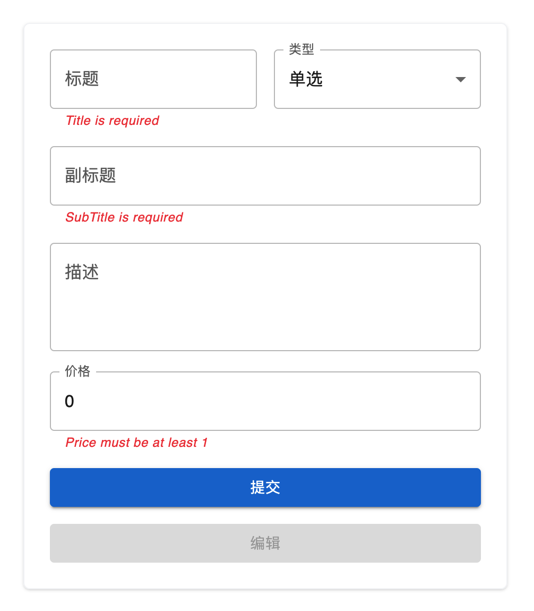

# Typescript React Form Testing Program

## 代码面试流程

请按照任务要求，组件样式应与截图相匹配。  
这个任务仅用验证面试者的编程能力，你有七天时间完成这个任务，

- 基于 master 创建一个新的分支，而不是直接在 master 上开发
- 完成后创建一个 Pull Request
- 请尽量在需求内使用你认为的最佳实践来进行开发，

如果你有任何疑问，请随时在 issues 提出来，我们很高兴为您提供帮助。  
当你已经准备好让 PR 进行审核时，请在 PR 留言告诉我。  
如果你觉得你能很完美的完成这个任务，但是对 github 的流程不是很熟悉，那么请以你熟悉的方式将代码发给我。

## 提示

这个组件不会用在真实的生产环境中，仅仅只是用来测试开发者的编程能力，您的代码将会被逐行进行 review 和评分，所以你可以把它看作是一个真实的任务，并且展示你最好的编程实践。

以下情况，你的代码能够获得更高的评分：

1. 将任务拆分成较小的任务，并且逐步完成他们，并使用适当的 git commit 日志进行提交
2. 代码干净整洁，易于阅读与理解
3. 仔细思考变量的和函数的名字
4. 没有错别字，代码格式良好
5. 有意义并且能覆盖大多数重要功能的单元测试
6. 适当的提供有价值的注释，但仅仅只是必要的时候才需要。

## 任务详情：

我们推荐的基础设施：

1. 基础：Typescript + React
2. 组件库: Mui
3. 样式: Tailwindcss
4. 表单状态管理: Formik
5. 数据管理: react-query
6. 表单校验：Yup
7. 最好使用 github 的 pull request 提交你的代码

在代码中找到 TODO 来实现，还可以更改代码库中的任何代码来展示最佳实践，但是优先采用我们推荐的基础库来完成任务。
你也可以使用你熟悉的框架和库来完成任务

组件要求：

\

1. 表单有标题、类型、副标题、描述、价格这几个字段
2. 在提交的时候才进行校验
3. 不能完全颠覆修改组件的结构和逻辑
4. 点击提交需要将表单的值传递给接口，并且在提交的过程提交和编辑按钮变成 loading 状态
5. 点击提交后，编辑按钮设置为允许点击，并且重置表单
6. 点击编辑后，从接口获取刚刚创建内容并且填充到表单，
7. 点击编辑后，在 url 后面加上 ?id={正在编辑的 id} ，并且刷新页面表单也是填充状态

## 开始:

```
npm install
npm run start
```

## 任务提示：

1. 任务细节可以创建 issue 进行沟通
2. 如果你觉得七天时间无法完成这个任务，但是你对你的代码整洁度和逻辑很有信心，你也可以提交 PR
3. 提交 PR 后我们会将 CR 结果反馈给你

## API

- 创建: http://localhost:3004/courses
  - 请求方法: POST
  - 请求body: 
    - title: string
    - subTitle: string
    - description: string 可选
    - type: single | package
    - price: number

- 编辑: http://localhost:3004/courses
  - 请求方法: PUT
  - 请求body: 
    - title: string
    - subTitle: strings
    - description: string 可选
    - type: single | package
    - price: number

- 获取: http://localhost:3004/courses/{id}
  - 请求方法: GET

## 表单的校验规则

- title
  - 必填，提示：Title is required
  - 最少 3 个字符，提示：Title must be at least 3 characters
  - 最多 100 个字符，提示：Title must be less than 100 characters
- type
  - 必填，提示：Type is required
  - 只允许：single 和 package
- subTitle
  - 必填，提示：subTitle is required
  - 最少 3 个字符，提示：SubTitle must be at least 3 characters
  - 最多 200 个字符，提示：SubTitle must be less than 200 characters
- description
  - 最少 3 个字符，提示：Description must be at least 3 characters
  - 最多 1000 个字符，提示：Description must be less than 1000 characters
- price
  - 必填，提示：Price is required
  - 只允许数字
  - 最小数字 1，提示: Price must be at least 1
